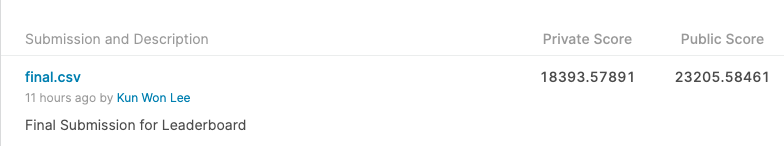
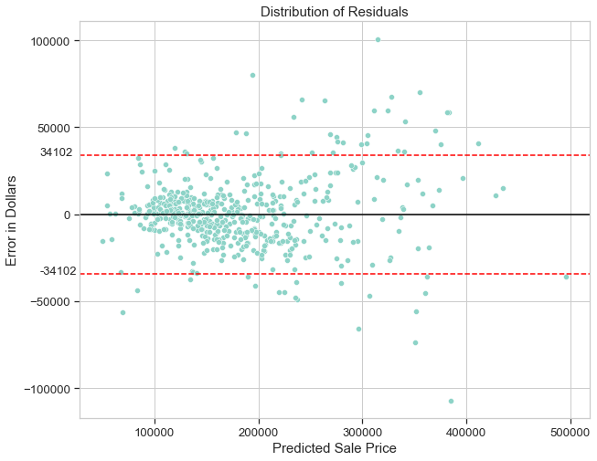
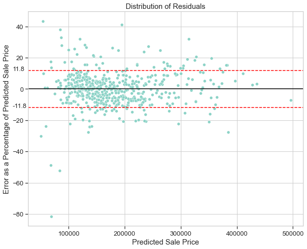
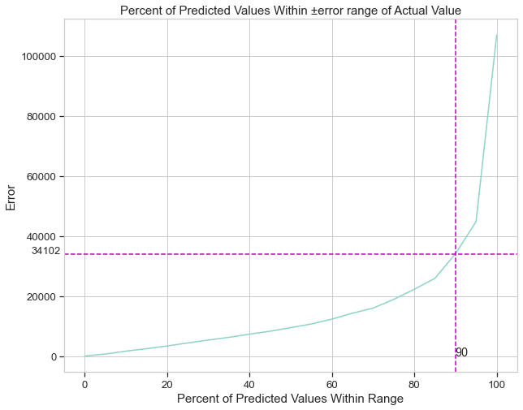

## Project 2 - Ames Housing Sale Price Model
### Creation of Model to Predict Housing Sale Price from Features of House
---

## Executive Summary 

The goal of this study is to create a regression model that can accurately predict the sale price based upon the features of a house to within an average error of $15,000 (Mean Average Error). This model would allow the Ames City Assessor Office to value a house accurately in order to calculate future property taxes.

Various techniques were employed to clean the data and train the regression model, including feature selection using LassoCV and log and Box-Cox transformation of variables. 

The final model is able to accurately predict sale price within a reasonable error margin, bring mean average error on the test set from a baseline in the null model of $57,584 down to $14,398. The final model is also able to predict 90% of sale prices correctly to within an error of ±34,102. Given the model's performance, we recommend for the Ames City Assessor Office to consider adopting the model for its use. 

The study also expounds on the limitations of the model, including difficulty predicting accurate prices at either end of the sale price range, and that it should not be used to predict prices of houses sold in years other than 2006-2010.

 

---

## Problem Statement

The Ames City Assessor Office requires an accurate estimation of the fair market valuation of a house annually in order to calculate future property taxes. The team has been tasked by the Assessor Office to create a model that can accurately predict the sale price based upon the features of a house to within an average error of $15,000 (Mean Average Error). The model would benefit the Assessor Office (Primary Stakeholder), as well as the general public who would benefit from fair taxation (Secondary Stakeholder)

The Ames City Assessor Office has provided a training set of housing data on which to train the model, and a test set of housing data on which to evaluate the model's performance. Both sets are taken from the actual sale prices and assessments of residential properties in Ames, Iowa from 2006 to 2010[[1]](#ref).

 

## Raw Data and Data Dictionary
* [`train.csv`](./datasets/train.csv): Raw train data for model
* [`test.csv`](./datasets/test.csv): Raw test data for evaluation

The combined data contains 2929 observations and 80 explanatory variables (43 categorical and 37 numerical).

The full data dictionary can be found [`here`](https://www.kaggle.com/c/dsi-us-11-project-2-regression-challenge/data).

 

## Methodology

### Data Cleaning

Out of 80 variables, 29 had null values. As the study wanted to preserve as much data as possible for the model to train on, the general approach was to impute values rather than to drop observations or variables.

The process to impute values was as follows:
1. Grouped variables into different features (e.g. Basement, Garage)
2. Examined if there was a correlation between null values for each feature and sale price. If there is a correlation, I cannot drop these null values without changing the distribution of the variable, as they are not randomly distributed.
3. Examined null values to determine if there were correlation between variables of the same feature
4. Posited the best explanation for the null value - if the null value was only in 1 variable across the feature variables, it may be due to a mistake in data entry. The null value should thus be imputed with a reasonable value (e.g. median/mode of similar houses). If the null value was in all feature variables, it was likely because the feature was not present in the house, and the imputed value should be 0 or NA depending on whether the variable was numerical or categorical.

The variable Lot Frontage had many null values, which it would not make sense to impute as 0 as each house should have some frontage. To resolve this, the study used IterativeImputer to predict the lot frontage of each house using the other variables. 

As there were many categorical variables which had a correlation with sale price, the study opted to dummify all categorical variables. We also chose to dummify 2 numerical variables, Year and Month of Sell Date, as these did not appear to have a linear relationship with sale price. This resulted in a dataset with more than 300 variables.

### Data Exploration (EDA)

The study examined the distribution of the target variable (sale price) and found that the variable was heavily right skewed. A Log transformation was thus applied to normalise the variable. 

### Data Modeling

To model the data, the train data was further split in train and test blocs in order to evaluate the performance of the model. R2 score on the test bloc was primarily used to evaluate the performance of the model, cross-checked with cross-validation score. 4 methods were progressively applied to improve performance.

Method A: Regression Analysis Method Selection

* The LassoCV analysis technique was found to be the best performer over OLS, RidgeCV and ElasticNetCV, likely due to the high multicollinearity from the large amount of variables and Lasso's ability to reduce their coefficients to 0. The Lasso model was thus chosen going forward.

Method B: Feature Selection Using Lasso

* Variables whose coefficients Lasso brought to 0 were removed from the model, reducing the total number of variables to 93. There was a marginal performance improvement from this method. 

Method C: Feature Transformation
* The distribution of numerical variables was inspected, and many area variables were found to be right skewed. A Box-Cox 2 Parameter transformation[[2]](#ref) was applied to bring these variables closer to a normal distribution. There was again a marginal performance improvement.

Method D: Dropping Outliers

* The relationship between the most highly correlated variables and sale price was investigated. 3 outlier observations that did not fit the relationship were dropped. There was a marginal performance improvement.

The performance of the model after each method is tabulated below.

|Model|Train R2 |Test R2| CV R2 | RMSE | MAE | 
|:--|:-:|:-:|:-:|:-:|:-:|
| Null Model (Baseline) | 0 | 0 | 0 | 80,011 | 57,584 | 
| OLS           | 0.95 | 0.87 | 0.73 | 23,966 | 15,342 |
| Ridge         | 0.92 | 0.87 | 0.85 | 24,961 | 16,757 |
| Lasso         | 0.92 | 0.89 | 0.84 | 22,838 | 15,259 |
| ElasticNet    | 0.92 | 0.88 | 0.86 | 24,411 | 16,283 |
| After Method B| 0.93 | 0.89 | 0.86 |22,704 | 15,138 |
| After Method C| 0.94 | 0.89 | 0.89 |22,111 | 14,851 |
| After Method D| 0.94 | 0.90 | 0.92 |20,925 | 14,398 |

CV refers to 5 fold cross-validation performed on train bloc. RMSE refers to Root Mean Squared Error on train bloc. MAE refers to Mean Absolute Error on test bloc. 

The methods have been able to decrease model bias and variance. The R2 of 0.90 shows that it is able to explain 90% of the variation in the test bloc, compared to 0% for the null model baseline. These results are echoed by the cross-validation scores, showing that the test bloc is representative. Given the methods' effectiveness, the model was then trained on the full train data with the methods above applied.

### Final Model Results

* The final model had an RMSE of 18,393 on the test set (based on private Kaggle score). This likely meant that the mean average error was below $15,000, fulfilling the Assessor's Office target. 

* Looking at the model trained just on the train bloc, the model appears to be able to predict sale price well with 90% of observations within an error of $34,102.

* In percentage terms, the model is able to predict sale price correctly 90% of the time within an error of 12% of the predicted price, though there are some gross outliers for very inexpensive houses.

* The errors are relatively small with 75% of observations with an error within $20,000.

## Recommendations
* The model is able to predict sale price to within a reasonable error margin, with a mean average error of below $15,000. The Ames City Assessor's Office should consider adopting this model for its use. 

### Limitations (Non-Technical)
* As the data is from 2006-2010, it is not clear if the model can be extrapolated to predict housing prices with sale date beyond this range. Nevertheless, the methods from this model could be applied to future years' datasets to improve the model further.
* The model performs less well at both ends of the sale price range, likely due to insufficient data. More data on inexpensive homes and expensive homes could be collected to improve the model. 

### Limitations (Technical)
* While feature selection with LassoCV worked well at keeping down variance, there is still a gap between train and test scores. We suspect that the variance can be further improved by further whittling down the number of variables. For example, more work could be done analysing the multicollinearity of different variables using the Variance Inflation Factor (VIF). This may produce a better model. 
* The use of a Box-Cox 2 Parameter transformation reduced the interpretability of the coefficients. If interpretability is a concern, it may be better to use a log(x+1) transform instead.

 

## Repo Contents
Code Folder
* [`data_cleaning.ipynb`](./code/data_cleaning.ipynb): Imputing missing values, dummifying variables
* [`data_eda.ipynb`](./code/data_eda.ipynb): Exploring correlation of variables with sale price
* [`data_modelling.ipynb`](./code/data_modelling.ipynb): Applying methods to model data

Datasets Folder
* [`train.csv`](./datasets/train.csv): Raw train data for model
* [`test.csv`](./datasets/test.csv): Raw test data for Kaggle competition
* [`train_clean.csv`](./datasets/train_clean.csv): Cleaned train data for model after data cleaning
* [`test_clean.csv`](./datasets/test_clean.csv): Cleaned test data for Kaggle competition after data cleaning
* [`train_clean_final.csv`](./datasets/train_clean_final.csv): Final cleaned train data for model after EDA
* [`test_clean_final.csv`](./datasets/test_clean_final.csv): Final cleaned test data for Kaggle competition after EDA

Images Folder 

* Images used for presentation

Predictions Folder
* [`final.csv`](./predictions/final.csv): Model predictions for Kaggle competition

Presentation Folder

* [`slides.pdf`](./presentation/slides.pdf): Slides used for presentation

 

## References

[1]: DeCock, Dean. (2011). Ames, Iowa: Alternative to the Boston Housing Data. Journal of Statistics Education 19(3), 1-14. Retrieved April 8, 2021, from http://jse.amstat.org/v19n3/decock.pdf.

[2]: Box, G., & Cox, D. (1964). An Analysis of Transformations. Journal of the Royal Statistical Society. Series B (Methodological), 26(2), 211-252. Retrieved April 8, 2021, from http://www.jstor.org/stable/2984418

